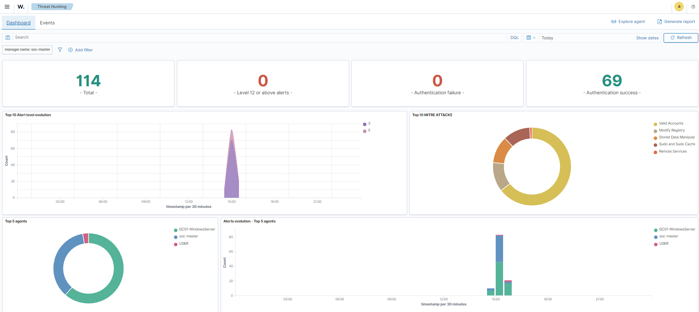
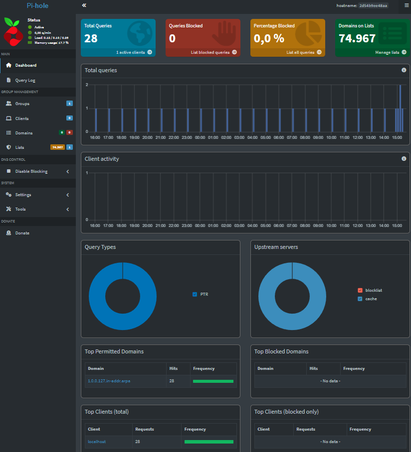
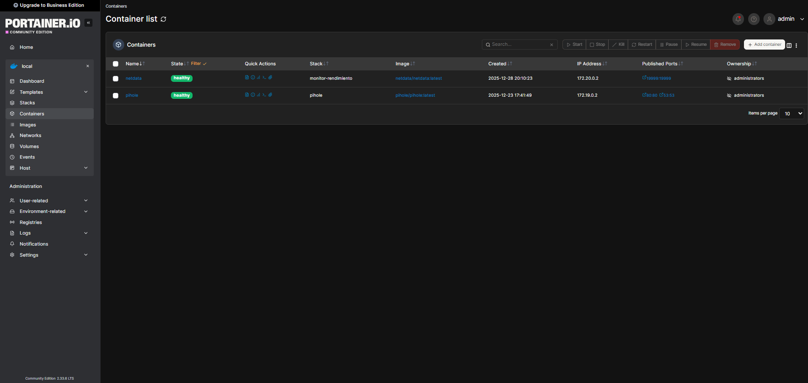
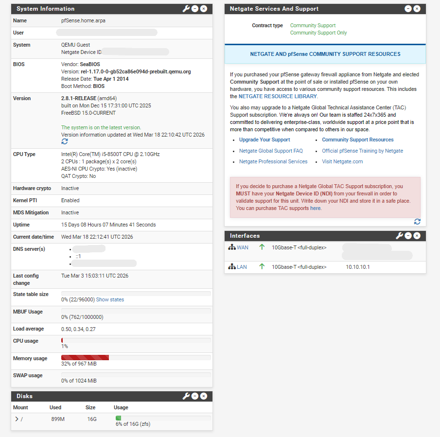

# Cybersecurity Home Lab

[](https://github.com/jairocron/Cybersecurity-Home-Lab)
[](https://ubuntu.com/server)
[](https://www.docker.com)
[](https://wazuh.com)

> Laboratorio de ciberseguridad construido desde cero para aprender seguridad ofensiva y defensiva de manera práctica. Documentado como evidencia de aprendizaje real.

Hola, soy estudiante de ciberseguridad de **Honduras** 🇭🇳, aprendiendo seguridad ofensiva y defensiva de manera autodidacta con enfoque en entornos empresariales reales. Este repositorio documenta cada fase de mi proceso de aprendizaje.

---

## Tabla de Contenidos

- [¿Por qué este laboratorio?](#-por-qué-este-laboratorio)
- [Hardware](#-hardware)
- [Fase 1 — SOC con Raspberry Pi 5](#-fase-1--soc-con-raspberry-pi-5)
- [Próximas Fases](#-próximas-fases)
- [Cómo replicar este laboratorio](#-cómo-replicar-este-laboratorio)

---

## ¿Por qué este laboratorio?

La ciberseguridad se aprende haciendo, no solo leyendo. Este lab existe para:

- Practicar ataques y defensas en un entorno **controlado y legal**
- Entender cómo funcionan los entornos empresariales reales
- Documentar el proceso como evidencia de habilidades prácticas
- Construir una base sólida orientada a seguridad ofensiva

---

## Hardware

| Dispositivo | Specs | Rol actual |
|---|---|---|
| Raspberry Pi 5 | 16GB RAM, SSD 256GB | SOC — Wazuh, Pi-hole, servicios |
| PC Principal | AMD Ryzen, RTX 4060 | Estación de trabajo principal |
| Lenovo ThinkCentre M920q | Intel i5-8500T, 32GB DDR4, 256GB SSD | Hypervisor — Proxmox |
---

## Fase 1 — SOC con Raspberry Pi 5

La primera fase fue transformar una Raspberry Pi 5 en un SOC (Centro de Operaciones de Seguridad) ligero y funcional.

### Arquitectura

```
Red doméstica (192.168.1.x)
    │
    └── Raspberry Pi 5 (soc-master)
            ├── Wazuh SIEM      (bare metal)
            ├── Pi-hole DNS     (Docker)
            ├── Portainer       (Docker)
            ├── Netdata         (Docker)
            └── Tailscale       (acceso remoto seguro)
```

### Stack Tecnológico

| Servicio | Implementación | Puerto | Función |
|---|---|---|---|
| **Wazuh** | Bare Metal | 443 | SIEM — centraliza y analiza alertas |
| **Pi-hole** | Docker | 8080 | DNS filtering — 74,000+ dominios bloqueados |
| **Portainer** | Docker | 9443 | Gestión visual de contenedores |
| **Netdata** | Docker | 19999 | Monitoreo de sistema en tiempo real |
| **Tailscale** | Sistema | — | Acceso remoto cifrado |

### Evidencia del Lab Operativo

| Servicio | Captura |
|---|---|
| **Wazuh SIEM** |  |
| **Pi-hole DNS** |  |
| **Portainer** |  |

### Desafíos técnicos resueltos

-  Conflicto de puerto 53 con `systemd-resolved` — resuelto desactivando el servicio
- ✅ Certificado SSL de Wazuh con IP incorrecta — resuelto regenerando certificados
- ✅ Actualización de Immich sin pérdida de datos vía Portainer
- ✅ Pi-hole bloqueando dominios de iCloud y banca — resuelto con whitelist selectiva

---

## Próximas Fases

El laboratorio está en construcción activa. Las siguientes fases se irán documentando a medida que se implementen.

### Fase 2 — Entorno Empresarial con Proxmox *(en construcción)*
Transformación de un Lenovo ThinkCentre M920q en un hypervisor
de laboratorio empresarial con red segmentada.

Proxmox Virtual Environment 9.1 instalado sobre bare metal, con
dos bridges de red configurados para separar el tráfico doméstico
del laboratorio aislado.

### pfSense — Firewall y segmentación de red

pfSense desplegado como VM en Proxmox para segmentar el tráfico
entre la red doméstica y la red aislada de laboratorio.

Dos bridges configurados en Proxmox:
- vmbr0 — red doméstica, conectada al router principal
- vmbr1 — red aislada de laboratorio, sin acceso a internet directo

pfSense actúa como gateway entre ambos segmentos, controlando
el tráfico entrante y saliente del laboratorio.



#### Desafíos técnicos resueltos
✅ Configuración de interfaces WAN/LAN en pfSense apuntando a vmbr0/vmbr1  
✅ Reglas de firewall para aislar el tráfico del laboratorio  
✅ Acceso controlado desde red doméstica hacia red aislada  

### Fase 3 — Active Directory *(planificada)*
- Dominio Windows Server 2022
- Usuarios, grupos y políticas
- Escenario de ataques y detección

### Fase 4 — Seguridad Ofensiva *(planificada)*
- Ataques de Active Directory desde Kali Linux
- AS-REP Roasting, Kerberoasting, BloodHound
- Detección de ataques en Wazuh

---

## Cómo replicar este laboratorio

### Prerrequisitos

- Raspberry Pi 5 (o equivalente) con Ubuntu Server instalado
- Acceso SSH configurado
- Docker y Docker Compose instalados

### 1. Clonar el repositorio

```bash
git clone https://github.com/jairocron/Cybersecurity-Home-Lab.git
cd Cybersecurity-Home-Lab
```

### 2. Configurar variables de entorno

```bash
cp .env.example .env
nano .env  # edita con tus valores
```

### 3. Levantar los servicios

```bash
docker-compose up -d
```

Servicios desplegados:
- **Portainer** → `https://<IP-RPi>:9443`
- **Netdata** → `http://<IP-RPi>:19999`
- **Pi-hole** → `http://<IP-RPi>:8080/admin`

### 4. Wazuh (instalación separada)

Wazuh corre directamente sobre el sistema operativo para mayor rendimiento. Seguir la [documentación oficial](https://documentation.wazuh.com/current/installation-guide/wazuh-server/step-by-step.html).

### Solución de problemas comunes

**Puerto 53 ocupado por systemd-resolved:**
```bash
sudo systemctl stop systemd-resolved
sudo systemctl disable systemd-resolved
```
> Configura un DNS alternativo en `/etc/resolv.conf` después de esto.

---

## Contacto

- GitHub: [@jairocron](https://github.com/jairocron)
- Correo: jairocron@proton.me

---

> ⚠️ Todo el contenido de este repositorio es para fines educativos en entornos controlados y legales.
